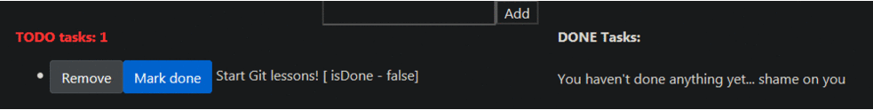

# PSweb - todo application

  Simple TODO application build with Angular7 for educational purposes.

## Demo



## Built With

* [Angular CLI](https://github.com/angular/angular-cli) - version 7.2.15.
* [Firestore](https://firebase.google.com/docs/firestore) - (database) version 5.2.1.
* [TypeScript](https://www.typescriptlang.org/) - version 3.2.4

## Development server

Install necessary packages,
```
npm install
```
and then run
```
ng serve
```
for a dev server. Navigate to `http://localhost:4200/`. The app will automatically reload if you change any of the source files.

### Prerequisites

* Install v10.15.3 or latest version of [Node.js](https://nodejs.org/en/download/) from here
* Install text editor like [Sublime Text](https://www.sublimetext.com/3) or [Visual Studio Code](https://code.visualstudio.com/download)

## License

This project is licensed under the MIT License
